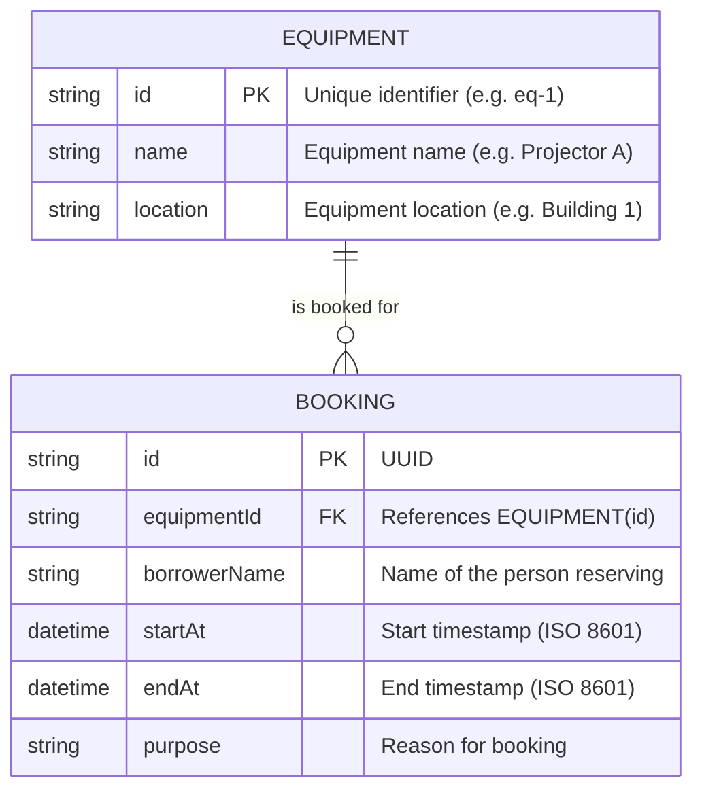

# Campus Equipment Booking API — API Contract & Data Model

## 1. Overview
- **Base URL**: `http://localhost:8787/api` (Local development)
- **Protocol**: HTTP/1.1 or HTTP/2
- **Data Exchange Format**: JSON (`application/json`)

---

## 2. Data Model & ERD

### Entity-Relationship Diagram (ERD)



### Table Definitions (SQLite / D1)

```sql
CREATE TABLE equipment (
  id TEXT PRIMARY KEY,
  name TEXT NOT NULL,
  location TEXT NOT NULL
);

CREATE TABLE bookings (
  id TEXT PRIMARY KEY,
  equipmentId TEXT NOT NULL,
  borrowerName TEXT NOT NULL,
  startAt DATETIME NOT NULL,
  endAt DATETIME NOT NULL,
  purpose TEXT NOT NULL,
  FOREIGN KEY (equipmentId) REFERENCES equipment(id)
);
```

---

## 3. Endpoints Specification

### 3.1. Equipment Endpoints

#### `GET /api/equipment`
- **Purpose**: Retrieve a list of all campus equipment available for booking.
- **Request Headers**: `Accept: application/json`
- **Request Body**: None
- **Response**: `200 OK`
```json
[
  {
    "id": "eq-1",
    "name": "Projector A",
    "location": "Building 1"
  },
  {
    "id": "eq-2",
    "name": "Camera B",
    "location": "Building 2"
  }
]
```

---

### 3.2. Bookings Endpoints

#### `GET /api/bookings`
- **Purpose**: List all existing bookings.
- **Request Body**: None
- **Response**: `200 OK`
```json
[
  {
    "id": "9422c66a-295d-4276-a662-392b6252ef27",
    "equipmentId": "eq-1",
    "borrowerName": "Somchai Jaidee",
    "startAt": "2026-10-20T09:00:00.000Z",
    "endAt": "2026-10-20T11:00:00.000Z",
    "purpose": "Class presentation"
  }
]
```

#### `GET /api/bookings/:id`
- **Purpose**: Retrieve details of a single booking by its unique identifier.
- **URL Parameters**:
  - `id` (string, required): Booking ID
- **Response**:
  - `200 OK`: Booking object found.
  - `404 Not Found`: `{ "error": "Booking not found" }`

#### `POST /api/bookings`
- **Purpose**: Create a new equipment booking.
- **Request Headers**: `Content-Type: application/json`
- **Request Body**:
```json
{
  "equipmentId": "eq-1",
  "borrowerName": "Somchai Jaidee",
  "startAt": "2026-10-20T09:00:00.000Z",
  "endAt": "2026-10-20T11:00:00.000Z",
  "purpose": "Class presentation"
}
```
- **Validation Rules**:
  1. All fields (`equipmentId`, `borrowerName`, `startAt`, `endAt`, `purpose`) are required and non-empty.
  2. `startAt` and `endAt` must be valid parseable ISO-8601 timestamps.
  3. `startAt` must be strictly before `endAt`.
  4. `equipmentId` must exist in the `equipment` table.
  5. The requested time range must not overlap with any existing booking for the specified `equipmentId`.
- **Response**:
  - `201 Created`: Returns the created booking object including generated `id`.
  - `400 Bad Request`: Validation failure (missing fields, invalid date, startAt >= endAt, equipment not found).
  - `409 Conflict`: Equipment is already booked during this time interval.

#### `PATCH /api/bookings/:id`
- **Purpose**: Update one or more fields of an existing booking.
- **URL Parameters**:
  - `id` (string, required): Booking ID
- **Request Body** (partial updates allowed):
```json
{
  "purpose": "Updated class presentation"
}
```
- **Validation Rules**:
  - If `startAt` or `endAt` is changed, the resulting `startAt` must be before `endAt`.
  - If `equipmentId` is changed, the new equipment must exist.
  - The new time range must not conflict with other bookings (excluding itself: `id != ?`).
- **Response**:
  - `200 OK`: Returns the updated booking object.
  - `400 Bad Request`: Validation failure.
  - `404 Not Found`: `{ "error": "Booking not found" }`
  - `409 Conflict`: `{ "error": "Equipment is already booked during this time" }`

#### `DELETE /api/bookings/:id`
- **Purpose**: Cancel/delete an existing booking.
- **URL Parameters**:
  - `id` (string, required): Booking ID
- **Response**:
  - `204 No Content`: Deletion successful (empty response body).
  - `404 Not Found`: `{ "error": "Booking not found" }`

---

## 4. HTTP Status Code Justifications & Error Formats

### Standard Error Response Format
All error responses adhere strictly to the JSON schema:
```json
{
  "error": "A message understandable to a user or developer"
}
```

### Rationale for Status Code Choices
- **`200 OK`**: Standard successful response for retrieval and update operations (`GET`, `PATCH`).
- **`201 Created`**: Returned by `POST /bookings` to signify successful resource creation along with the newly generated record.
- **`204 No Content`**: Standard for successful deletion (`DELETE`), indicating that the action was performed and there is no response entity body.
- **`400 Bad Request`**: Used when the client sends malformed JSON, omits required parameters, submits non-chronological dates (`startAt >= endAt`), or specifies a non-existent `equipmentId`.
- **`404 Not Found`**: Used when a specific resource (`/bookings/:id`) cannot be located in the database, or an unknown route is accessed.
- **`409 Conflict`**: Specifically used when the request is syntactically valid, but cannot be processed due to a business rule conflict — namely, overlapping equipment reservations for the same time window.

---

## 5. Overlap Detection Business Logic

To prevent double booking of equipment, an overlap check is evaluated in SQL using parameterized queries:

Two intervals `[A_start, A_end]` and `[B_start, B_end]` overlap if and only if:
$$\text{startAt} < \text{newEndAt} \quad \text{AND} \quad \text{endAt} > \text{newStartAt}$$

SQL Query:
```sql
SELECT * FROM bookings 
WHERE equipmentId = ? 
  AND (? IS NULL OR id != ?)
  AND (startAt < ? AND endAt > ?)
```
This ensures both partial and full overlaps, encompassing, and interior intervals are detected accurately.
