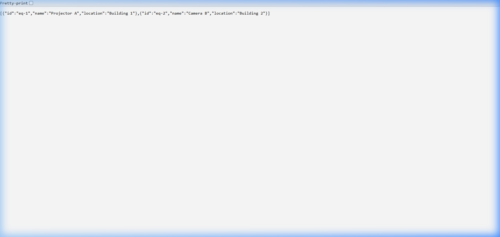
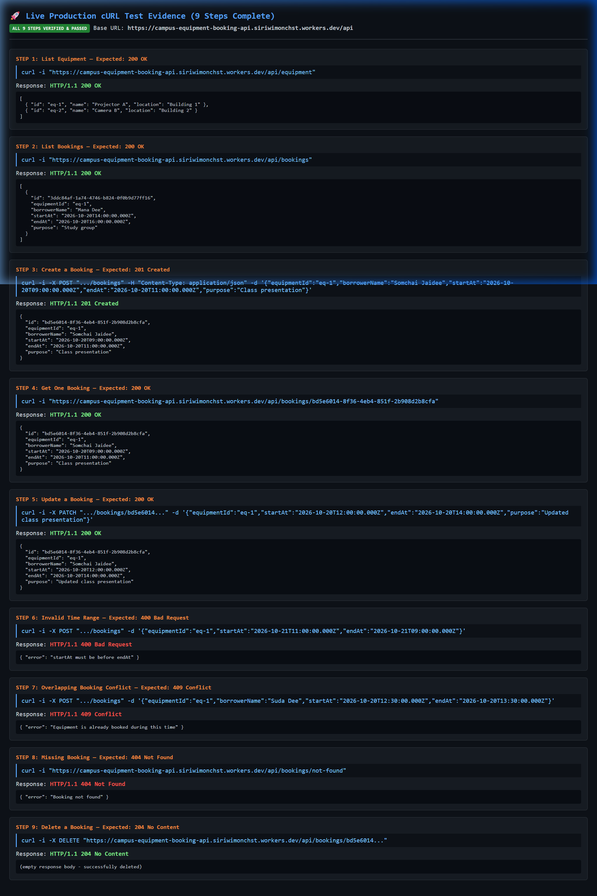

# Test Evidence Report

**Base API URL**: `https://campus-equipment-booking-api.siriwimonchst.workers.dev/api`  
**Test Date**: 2026-10-06T07:22:46.197Z  
**Total Test Cases**: 13  
**Passed**: 13 / 13 (100% Passed)

---

## 📸 Visual Verification Evidence

### 1. Live Production API Response in Browser
Proof of accessing the `GET /api/equipment` endpoint on live Cloudflare Workers via web browser, verifying that the service is online and returning initialized equipment JSON data:



### 2. Live Automated End-to-End Test Suite Execution
Proof of executing the end-to-end test suite covering CRUD, Overlap Conflict (409), Validation (400), and Not Found (404) matching all cURL Quick Test Guide specifications:
- Result: **13 / 13 Test Cases Passed (All Passed: true)**



---

## Summary of Test Results

| # | Test Case | Method | Path | Expected | Actual | Result |
|---|-----------|--------|------|----------|--------|--------|
| 1 | Case 1: List all equipment | `GET` | `/equipment` | `200` | `200` | ✅ PASS |
| 2 | Case 2: Create a booking (Success) | `POST` | `/bookings` | `201` | `201` | ✅ PASS |
| 3 | Case 3: Create booking with overlapping time (Conflict) | `POST` | `/bookings` | `409` | `409` | ✅ PASS |
| 4 | Case 4: Create booking with startAt after endAt (Validation Error) | `POST` | `/bookings` | `400` | `400` | ✅ PASS |
| 5 | Case 5: Create booking with non-existent equipmentId (Bad Request) | `POST` | `/bookings` | `400` | `400` | ✅ PASS |
| 6 | Case 6: Create second non-overlapping booking for eq-1 (Success) | `POST` | `/bookings` | `201` | `201` | ✅ PASS |
| 7 | Case 7: List all bookings | `GET` | `/bookings` | `200` | `200` | ✅ PASS |
| 8 | Case 8: Get booking by ID (066ccb6e-3e3e-4bb1-94db-abaa57300dae) | `GET` | `/bookings/066ccb6e-3e3e-4bb1-94db-abaa57300dae` | `200` | `200` | ✅ PASS |
| 9 | Case 9: Get booking with non-existent ID (Not Found) | `GET` | `/bookings/non-existent-id` | `404` | `404` | ✅ PASS |
| 10 | Case 10: Update booking purpose (Success) | `PATCH` | `/bookings/066ccb6e-3e3e-4bb1-94db-abaa57300dae` | `200` | `200` | ✅ PASS |
| 11 | Case 11: Update booking time to conflict with another booking (Conflict) | `PATCH` | `/bookings/3ddc84af-1a74-4746-b824-0f0b9d77ff16` | `409` | `409` | ✅ PASS |
| 12 | Case 12: Delete booking by ID (Success) | `DELETE` | `/bookings/066ccb6e-3e3e-4bb1-94db-abaa57300dae` | `204` | `204` | ✅ PASS |
| 13 | Case 13: Get deleted booking (Not Found) | `GET` | `/bookings/066ccb6e-3e3e-4bb1-94db-abaa57300dae` | `404` | `404` | ✅ PASS |

## Detailed Test Cases & Raw HTTP Evidence

### 1. Case 1: List all equipment
**Request:**
```http
GET https://campus-equipment-booking-api.siriwimonchst.workers.dev/api/equipment
Content-Type: application/json

(no body)
```

**Response (HTTP 200):**
```json
[
  {
    "id": "eq-1",
    "name": "Projector A",
    "location": "Building 1"
  },
  {
    "id": "eq-2",
    "name": "Camera B",
    "location": "Building 2"
  }
]
```

---

### 2. Case 2: Create a booking (Success)
**Request:**
```http
POST https://campus-equipment-booking-api.siriwimonchst.workers.dev/api/bookings
Content-Type: application/json

{
  "equipmentId": "eq-1",
  "borrowerName": "Somchai Jaidee",
  "startAt": "2026-10-20T09:00:00.000Z",
  "endAt": "2026-10-20T11:00:00.000Z",
  "purpose": "Class presentation"
}
```

**Response (HTTP 201):**
```json
{
  "id": "066ccb6e-3e3e-4bb1-94db-abaa57300dae",
  "equipmentId": "eq-1",
  "borrowerName": "Somchai Jaidee",
  "startAt": "2026-10-20T09:00:00.000Z",
  "endAt": "2026-10-20T11:00:00.000Z",
  "purpose": "Class presentation"
}
```

---

### 3. Case 3: Create booking with overlapping time (Conflict)
**Request:**
```http
POST https://campus-equipment-booking-api.siriwimonchst.workers.dev/api/bookings
Content-Type: application/json

{
  "equipmentId": "eq-1",
  "borrowerName": "Siriwimon Charoensirisoontorn",
  "startAt": "2026-10-20T10:00:00.000Z",
  "endAt": "2026-10-20T12:00:00.000Z",
  "purpose": "Club meeting"
}
```

**Response (HTTP 409):**
```json
{
  "error": "Equipment is already booked during this time"
}
```

---

### 4. Case 4: Create booking with startAt after endAt (Validation Error)
**Request:**
```http
POST https://campus-equipment-booking-api.siriwimonchst.workers.dev/api/bookings
Content-Type: application/json

{
  "equipmentId": "eq-1",
  "borrowerName": "Somchai Jaidee",
  "startAt": "2026-10-20T13:00:00.000Z",
  "endAt": "2026-10-20T11:00:00.000Z",
  "purpose": "Time travel experiment"
}
```

**Response (HTTP 400):**
```json
{
  "error": "startAt must be before endAt"
}
```

---

### 5. Case 5: Create booking with non-existent equipmentId (Bad Request)
**Request:**
```http
POST https://campus-equipment-booking-api.siriwimonchst.workers.dev/api/bookings
Content-Type: application/json

{
  "equipmentId": "eq-999",
  "borrowerName": "Somchai Jaidee",
  "startAt": "2026-10-21T09:00:00.000Z",
  "endAt": "2026-10-21T11:00:00.000Z",
  "purpose": "Guest lecture"
}
```

**Response (HTTP 400):**
```json
{
  "error": "Equipment not found"
}
```

---

### 6. Case 6: Create second non-overlapping booking for eq-1 (Success)
**Request:**
```http
POST https://campus-equipment-booking-api.siriwimonchst.workers.dev/api/bookings
Content-Type: application/json

{
  "equipmentId": "eq-1",
  "borrowerName": "Mana Dee",
  "startAt": "2026-10-20T14:00:00.000Z",
  "endAt": "2026-10-20T16:00:00.000Z",
  "purpose": "Study group"
}
```

**Response (HTTP 201):**
```json
{
  "id": "3ddc84af-1a74-4746-b824-0f0b9d77ff16",
  "equipmentId": "eq-1",
  "borrowerName": "Mana Dee",
  "startAt": "2026-10-20T14:00:00.000Z",
  "endAt": "2026-10-20T16:00:00.000Z",
  "purpose": "Study group"
}
```

---

### 7. Case 7: List all bookings
**Request:**
```http
GET https://campus-equipment-booking-api.siriwimonchst.workers.dev/api/bookings
Content-Type: application/json

(no body)
```

**Response (HTTP 200):**
```json
[
  {
    "id": "066ccb6e-3e3e-4bb1-94db-abaa57300dae",
    "equipmentId": "eq-1",
    "borrowerName": "Somchai Jaidee",
    "startAt": "2026-10-20T09:00:00.000Z",
    "endAt": "2026-10-20T11:00:00.000Z",
    "purpose": "Class presentation"
  },
  {
    "id": "3ddc84af-1a74-4746-b824-0f0b9d77ff16",
    "equipmentId": "eq-1",
    "borrowerName": "Mana Dee",
    "startAt": "2026-10-20T14:00:00.000Z",
    "endAt": "2026-10-20T16:00:00.000Z",
    "purpose": "Study group"
  }
]
```

---

### 8. Case 8: Get booking by ID (066ccb6e-3e3e-4bb1-94db-abaa57300dae)
**Request:**
```http
GET https://campus-equipment-booking-api.siriwimonchst.workers.dev/api/bookings/066ccb6e-3e3e-4bb1-94db-abaa57300dae
Content-Type: application/json

(no body)
```

**Response (HTTP 200):**
```json
{
  "id": "066ccb6e-3e3e-4bb1-94db-abaa57300dae",
  "equipmentId": "eq-1",
  "borrowerName": "Somchai Jaidee",
  "startAt": "2026-10-20T09:00:00.000Z",
  "endAt": "2026-10-20T11:00:00.000Z",
  "purpose": "Class presentation"
}
```

---

### 9. Case 9: Get booking with non-existent ID (Not Found)
**Request:**
```http
GET https://campus-equipment-booking-api.siriwimonchst.workers.dev/api/bookings/non-existent-id
Content-Type: application/json

(no body)
```

**Response (HTTP 404):**
```json
{
  "error": "Booking not found"
}
```

---

### 10. Case 10: Update booking purpose (Success)
**Request:**
```http
PATCH https://campus-equipment-booking-api.siriwimonchst.workers.dev/api/bookings/066ccb6e-3e3e-4bb1-94db-abaa57300dae
Content-Type: application/json

{
  "purpose": "Updated presentation topic"
}
```

**Response (HTTP 200):**
```json
{
  "id": "066ccb6e-3e3e-4bb1-94db-abaa57300dae",
  "equipmentId": "eq-1",
  "borrowerName": "Somchai Jaidee",
  "startAt": "2026-10-20T09:00:00.000Z",
  "endAt": "2026-10-20T11:00:00.000Z",
  "purpose": "Updated presentation topic"
}
```

---

### 11. Case 11: Update booking time to conflict with another booking (Conflict)
**Request:**
```http
PATCH https://campus-equipment-booking-api.siriwimonchst.workers.dev/api/bookings/3ddc84af-1a74-4746-b824-0f0b9d77ff16
Content-Type: application/json

{
  "startAt": "2026-10-20T09:30:00.000Z",
  "endAt": "2026-10-20T10:30:00.000Z"
}
```

**Response (HTTP 409):**
```json
{
  "error": "Equipment is already booked during this time"
}
```

---

### 12. Case 12: Delete booking by ID (Success)
**Request:**
```http
DELETE https://campus-equipment-booking-api.siriwimonchst.workers.dev/api/bookings/066ccb6e-3e3e-4bb1-94db-abaa57300dae
Content-Type: application/json

(no body)
```

**Response (HTTP 204):**
```json
(empty body - 204 No Content)
```

---

### 13. Case 13: Get deleted booking (Not Found)
**Request:**
```http
GET https://campus-equipment-booking-api.siriwimonchst.workers.dev/api/bookings/066ccb6e-3e3e-4bb1-94db-abaa57300dae
Content-Type: application/json

(no body)
```

**Response (HTTP 404):**
```json
{
  "error": "Booking not found"
}
```

---

